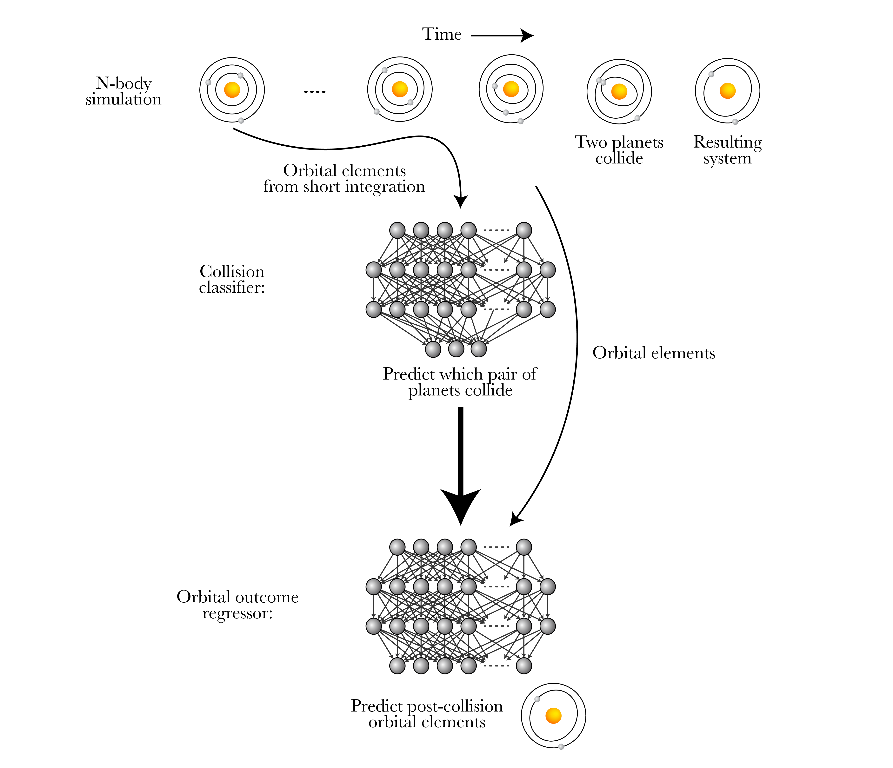

# [Accelerating Giant Impact Simulations with Machine Learning](https://arxiv.org/abs/2408.08873)
This repository contains code and supplementary material for the paper https://arxiv.org/abs/2408.08873, including scripts to generate the training set of N-body simulations, train the ML models, evaluate their performance, and create the paper's figures.

See [SPOCK](https://github.com/dtamayo/spock) for a user-friendly API that interfaces with the collision classifier and orbital outcome regressor models.

# Data availability
Data files that are small enough to be hosted on GitHub are included in the [data/](https://github.com/CalebLammers/ML_for_collisions/tree/main/data) folder. Data omitted due to size restrictions can be re-generated using the scripts included above. Alternatively, feel free to reach out if you'd like access to a larger data file. 

# Contact
Contact me at caleb [dot] lammers [at] princeton [dot] edu if you have questions/comments.
